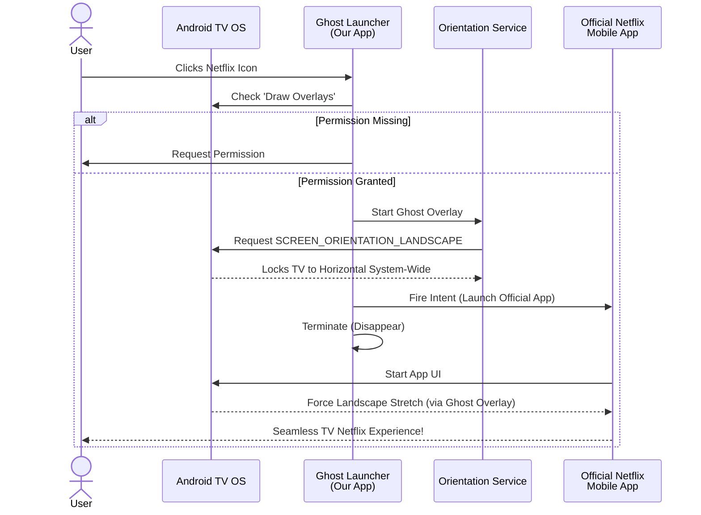

# Netflix TV Ghost Launcher

A custom Android TV wrapper designed to force the official Netflix Mobile app into a true horizontal, TV-friendly experience.

## The Problem
Many uncertified Android TVs (e.g., Amlogic boards) are blocked from running the official Android TV version of Netflix (`com.netflix.ninja`). The only workaround is to use the Netflix Mobile App (`com.netflix.mediaclient`). However, the mobile app is locked to Portrait mode, making it impossible to use on a TV screen without stretching or black bars.

## The Solution
This project is a **"Ghost Launcher"**. It provides a native Android TV launcher icon for Netflix. When clicked, it performs the following magic invisibly in the background:

1. **System Alert Overlay:** It creates a completely invisible 0x0 pixel overlay window using the `SYSTEM_ALERT_WINDOW` permission.
2. **Force Orientation:** It explicitly requests `ActivityInfo.SCREEN_ORIENTATION_LANDSCAPE` on that invisible window.
3. **App Handoff:** It immediately fires an intent to open the official Netflix mobile app.
4. **Ghost Exit:** It closes itself.

### The Result
Because the invisible overlay is active, the Android OS physically forces the official Netflix Mobile app beneath it to stretch into perfect Landscape mode, providing a flawless full-screen TV experience without ever breaking the official app's signature or DRM!

### Architecture Diagram

## Setup Instructions
1. Install your preferred (working) Netflix Mobile APK onto your TV.
2. Build and install this Ghost Launcher APK.
3. Open the "Netflix" icon from your Android TV home screen.
4. On the very first launch, it will prompt you to grant the **"Display over other apps"** permission. Allow it.
5. Launch the app again. Netflix will now open perfectly horizontal!

## Technical Details
- **MainActivity:** Acts as the permission handler and intent dispatcher.
- **OrientationService:** Runs the `WindowManager.LayoutParams.TYPE_APPLICATION_OVERLAY` to force system-wide rotation.
- **No WebViews:** Completely bypasses WebView DRM limits (Error E100) by using the official app's native Widevine implementation.
