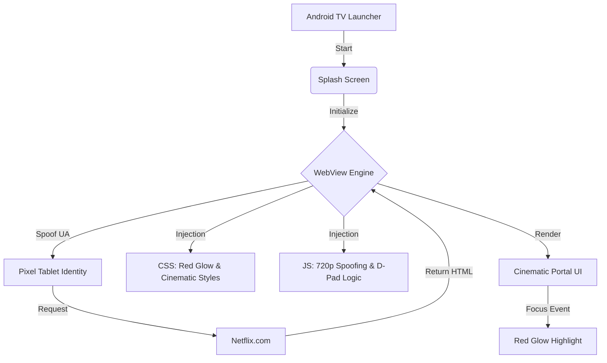

# Netflix TV Wrapper 📺

A high-fidelity, cinematic Android TV application built as a WebView wrapper for Netflix. This project uses advanced CSS/JS injection to transform the standard Netflix web interface into a premium TV portal with custom navigation, styling, and playback optimizations.


## ✨ Key Features

- **Cinematic UI**: Custom CSS injection for a "Dark Room" aesthetic with 4px corner radii and glassmorphic navigation.
- **Signature Focus State**: D-Pad optimized focus engine with **1.15x scaling** and a **Netflix Red (#E50914) glow**.
- **DRM & Update Bypass**: Automated hardware spoofing (Pixel Tablet) to bypass "Update Required" blocks and E100 DRM handshake errors.
- **720p/SD Optimization**: Force-spoofs device memory and resolution to ensure smooth playback on hardware with limited capabilities.
- **Premium Splash**: High-fidelity Netflix branding with a native red loading spinner.

## 🛠️ How It Works (Architecture)

The application operates as a "Cinematic Bridge" between the Android system and the Netflix web service.



## 🚀 Setup & Installation

### Prerequisites
- Android Studio Iguana or newer
- An Android TV or Emulator (API 21+)

### Build Steps
1. Clone the repository:
   ```bash
   git clone https://github.com/abhi963007/Netflix-TV-Wrapper.git
   ```
2. Open the project in **Android Studio**.
3. Select **"Sync Project with Gradle Files"**.
4. Connect your TV via ADB:
   ```bash
   adb connect <TV_IP_ADDRESS>
   ```
5. Click **Run**.

## 🔧 Technical Details

- **User-Agent Spoofing**: Uses a modern Pixel Tablet string to trigger the most compatible mobile-web player.
- **CSS Injection**: Leverages `evaluateJavascript` to apply styles post-load, ensuring "No-Line" boundary philosophy is maintained.
- **Permission Handshake**: Automatically grants `RESOURCE_PROTECTED_MEDIA_ID` to allow the WebView to access the hardware's Widevine CDM.

## 📜 License
This project is for educational purposes only. Netflix is a registered trademark of Netflix, Inc.
